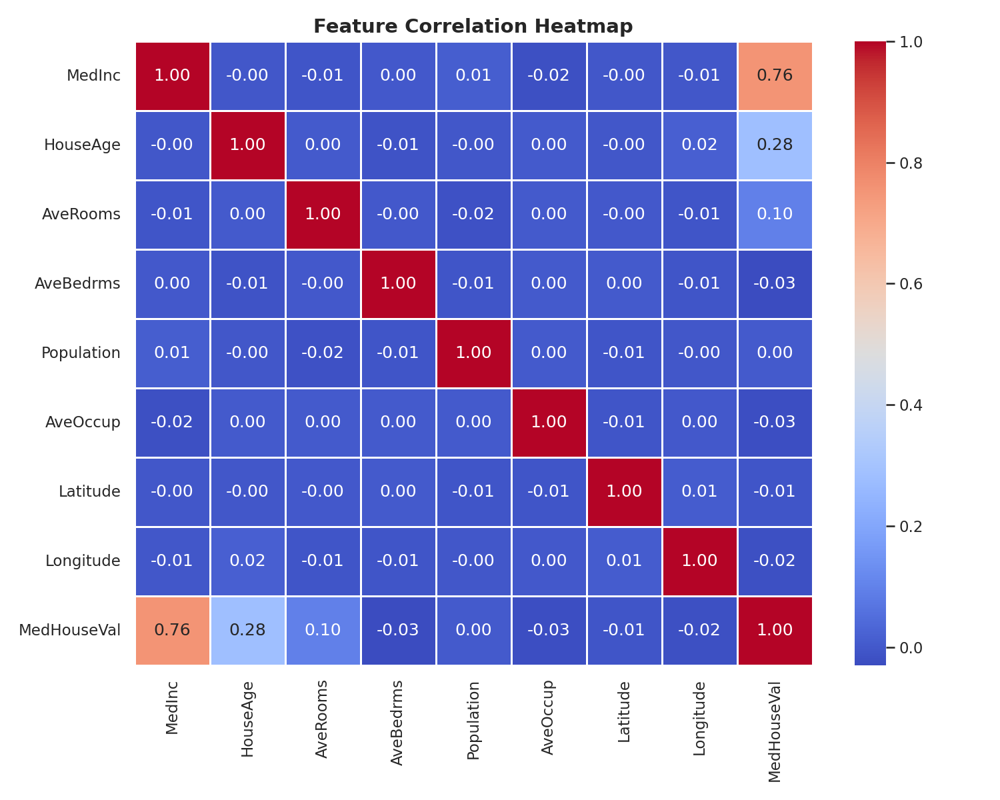
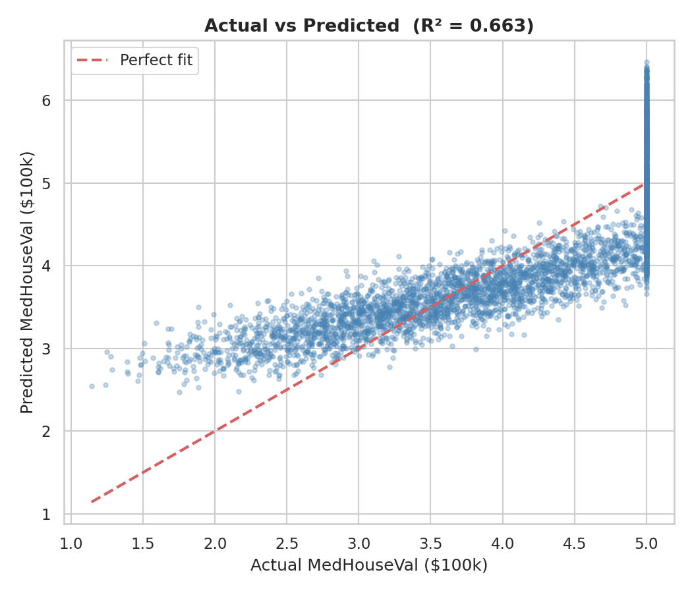
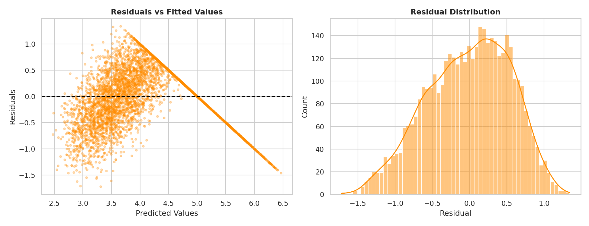
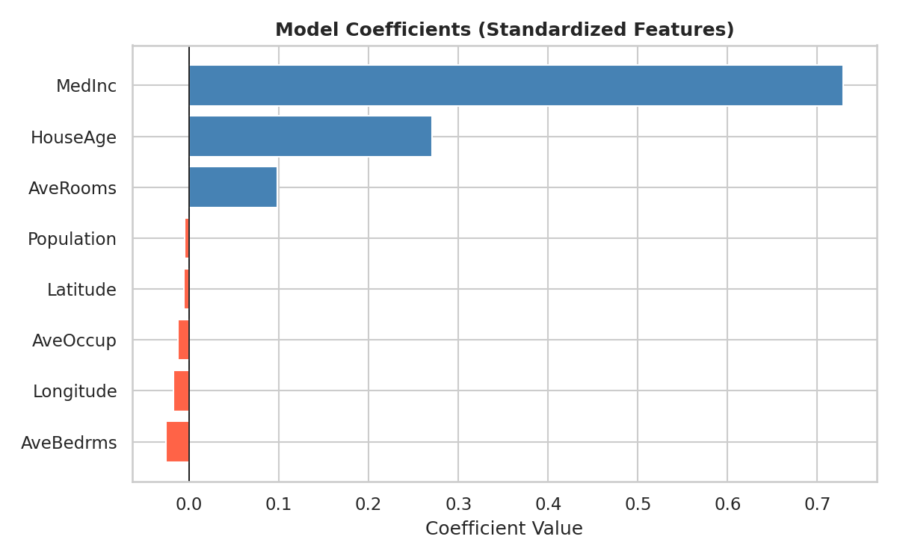

# 🏠 California House Price Predictor
### Linear Regression · End-to-End ML Project

[](https://python.org)
[](https://scikit-learn.org)
[](https://streamlit.io)
[](LICENSE)
[](https://maincrafts.com)

> **Task 1 — AI/ML Internship @ Maincrafts Technology**  
> A complete machine learning workflow: data loading, EDA, preprocessing, training, evaluation, and a live web app for predictions.

---

## 📌 Project Overview

This project trains a **Linear Regression** model on the **California Housing Dataset** (1990 U.S. Census, 20,640 records) to predict median house values. It covers the entire ML lifecycle — from raw data exploration to a deployable Streamlit web app.

| Metric | Value |
|--------|-------|
| **MAE** (Mean Absolute Error) | 0.4607 (~$46,000) |
| **RMSE** (Root Mean Squared Error) | 0.5571 |
| **R² Score** | 0.6634 (66.3% variance explained) |
| Training samples | 16,512 |
| Test samples | 4,128 |

---

## 🗂️ Repository Structure

```
california-house-price-predictor/
│
├── 📓 task1_ml_linear_regression.ipynb   # Main notebook (EDA → Training → Evaluation)
├── 🌐 app.py                              # Streamlit interactive web app
├── 🤖 predict_house_price.py             # CLI predictor script
├── 📄 task1_report.pdf                   # Full project report (4 pages)
├── 💾 linear_regression_model.pkl        # Saved model + scaler bundle
│
├── plots/                                # All generated visualizations
│   ├── heatmap.png
│   ├── target_dist.png
│   ├── feature_dists.png
│   ├── actual_vs_pred.png
│   ├── residuals.png
│   └── coefficients.png
│
├── requirements.txt
├── .gitignore
└── README.md
```

---

## 🚀 Quick Start

### 1. Clone the repository
```bash
git clone https://github.com/Pranavv28/california-house-price-predictor.git
cd california-house-price-predictor
```

### 2. Create a virtual environment & install dependencies
```bash
python -m venv venv
source venv/bin/activate        # Windows: venv\Scripts\activate
pip install -r requirements.txt
```

### 3. Run the Jupyter Notebook
```bash
jupyter notebook task1_ml_linear_regression.ipynb
```

### 4. Launch the Streamlit Web App
```bash
streamlit run app.py
```

### 5. CLI Predictor
```bash
python predict_house_price.py --demo      # demo with sample values
python predict_house_price.py             # interactive prompts
```

---

## 📊 Key Visualizations

| Correlation Heatmap | Actual vs Predicted |
|---|---|
|  |  |

| Residuals | Model Coefficients |
|---|---|
|  |  |

---

## 🔬 ML Workflow

```
Raw Data (sklearn)
     │
     ▼
Exploratory Data Analysis
  • Correlation heatmap
  • Feature & target distributions
  • Outlier detection
     │
     ▼
Preprocessing
  • 80/20 Train-Test Split (random_state=42)
  • StandardScaler (fit on train only → no leakage)
     │
     ▼
Model Training
  • LinearRegression (OLS)
  • All 8 features used
     │
     ▼
Evaluation
  • MAE, RMSE, R²
  • Actual vs Predicted scatter
  • Residual analysis
     │
     ▼
Deployment
  • Saved as .pkl
  • Streamlit Web App
  • CLI Predictor
```

---

## 🧠 Key Findings

- **MedInc** (median income) is the single strongest predictor — coefficient = **0.73** (standardized).
- **Geographic features** (Latitude, Longitude) significantly influence prices — coastal California commands a premium.
- The model struggles with high-value properties (>$400k) due to data censoring at $500k in the original dataset.
- Residuals are approximately normally distributed, confirming linear regression assumptions hold reasonably well.

---

## 🔧 Feature Descriptions

| Feature | Description | Unit |
|---------|-------------|------|
| `MedInc` | Median household income | $10,000 |
| `HouseAge` | Median house age in block group | Years |
| `AveRooms` | Average rooms per household | Count |
| `AveBedrms` | Average bedrooms per household | Count |
| `Population` | Block group population | People |
| `AveOccup` | Average household occupancy | Ratio |
| `Latitude` | Block group latitude | Degrees |
| `Longitude` | Block group longitude | Degrees |
| **`MedHouseVal`** | **TARGET: Median house value** | **$100,000** |

---

## 💡 Improvement Roadmap

- [ ] **Feature Engineering** — log-transform skewed features, interaction terms
- [ ] **Polynomial Regression** — capture non-linear relationships
- [ ] **Ridge / Lasso Regression** — handle multicollinearity with regularization
- [ ] **XGBoost / LightGBM** — expected R² > 0.85
- [ ] **Cross-Validation** — 5-fold CV for robust evaluation
- [ ] **Hyperparameter Tuning** — GridSearchCV / Optuna

---

## 📦 Dependencies

See [`requirements.txt`](requirements.txt) — core stack: `pandas`, `numpy`, `scikit-learn`, `matplotlib`, `seaborn`, `streamlit`, `jupyter`.

---

## 👤 Author

**Pranav Lakhe**  
B.Tech Student · Symbiosis Institute of Technology, Nagpur  
AI/ML Intern @ Maincrafts Technology  
🔗 [GitHub](https://github.com/Pranavv28)

---

## 📄 License

This project is licensed under the [MIT License](LICENSE).

---

<p align="center">
  <i>Built as part of the Maincrafts Technology AI/ML Internship · Task 1</i>
</p>
